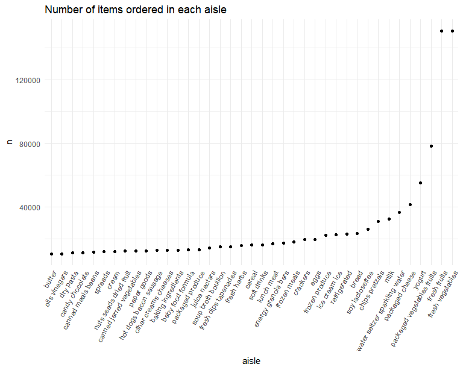

P8105 Homework 3
================
Madison Goldrich mpg2166

## Problem 1

#### Load the data:

``` r
data("instacart")

instacart =
  instacart |> 
  as_tibble()
```

#### Answer questions about the data:

The `instacart` dataset is 1384617 rows by 15 columns. According to the
description on the course website, “The dataset contains 1,384,617
observations of 131,209 unique users, where each row in the dataset is a
product from an order.” Some key variables include `product_id` which
identifies the product, `order_id` which identifies the order in which
the product was placed, `reordered` which identifies whether the product
has been ordered by the user in the past, among others. In total there
are 39123 products found in 131209 orders from 131209 distinct users.

Below is a table summarizing the number of items ordered from each
aisle. In total, there are 134 aisles, with fresh vegetables and fresh
fruits having by far the most items ordered.

``` r
instacart |> 
  count(aisle) |> 
  arrange(desc(n))
```

    ## # A tibble: 134 × 2
    ##    aisle                              n
    ##    <chr>                          <int>
    ##  1 fresh vegetables              150609
    ##  2 fresh fruits                  150473
    ##  3 packaged vegetables fruits     78493
    ##  4 yogurt                         55240
    ##  5 packaged cheese                41699
    ##  6 water seltzer sparkling water  36617
    ##  7 milk                           32644
    ##  8 chips pretzels                 31269
    ##  9 soy lactosefree                26240
    ## 10 bread                          23635
    ## # ℹ 124 more rows

Next is a plot that shows the number of items ordered in each aisle,
with aisles ordered by ascending number of items.

``` r
instacart |> 
  count(aisle) |> 
  filter(n > 10000) |> 
  mutate(aisle = fct_reorder(aisle, n)) |> 
  ggplot(aes(x = aisle, y = n)) +
  geom_point() +
  labs(title = "Number of items ordered in each aisle") +
  theme(axis.text.x = element_text(angle = 60, hjust = 1))
```



The next table shows the three most popular items in
`baking ingredients`, `dog food care`, and `packaged vegetables fruits`,
including the number of times each item is ordered.

``` r
instacart |> 
  filter(aisle %in% c("baking ingredients", "dog food care", "packaged vegetables fruits")) |> 
  group_by(aisle) |> 
  count(product_name) |> 
  mutate(rank = min_rank(desc(n))) |> 
  filter(rank < 4) |> 
  arrange(desc(n)) |> 
  knitr::kable()
```

| aisle                      | product_name                                  |    n | rank |
|:---------------------------|:----------------------------------------------|-----:|-----:|
| packaged vegetables fruits | Organic Baby Spinach                          | 9784 |    1 |
| packaged vegetables fruits | Organic Raspberries                           | 5546 |    2 |
| packaged vegetables fruits | Organic Blueberries                           | 4966 |    3 |
| baking ingredients         | Light Brown Sugar                             |  499 |    1 |
| baking ingredients         | Pure Baking Soda                              |  387 |    2 |
| baking ingredients         | Cane Sugar                                    |  336 |    3 |
| dog food care              | Snack Sticks Chicken & Rice Recipe Dog Treats |   30 |    1 |
| dog food care              | Organix Chicken & Brown Rice Recipe           |   28 |    2 |
| dog food care              | Small Dog Biscuits                            |   26 |    3 |

Table showing the mean hour of the day at which Pink Lady Apples and
Coffe Ice Cream are ordered on each day of the week. Pink lady apples
are generally purchased slightly earlier in the day than coffee ice
cream, except on day 5.

``` r
instacart |> 
  filter(product_name %in% c("Pink Lady Apples", "Coffee Ice Cream")) |> 
  group_by(product_name, order_dow) |> 
  summarize(mean_hour = mean(order_hour_of_day)) |> 
  pivot_wider(
    names_from = order_dow,
    values_from = mean_hour
  ) |> 
  knitr::kable(digits = 2)
```

    ## `summarise()` has grouped output by 'product_name'. You can override using the
    ## `.groups` argument.

| product_name     |     0 |     1 |     2 |     3 |     4 |     5 |     6 |
|:-----------------|------:|------:|------:|------:|------:|------:|------:|
| Coffee Ice Cream | 13.77 | 14.32 | 15.38 | 15.32 | 15.22 | 12.26 | 13.83 |
| Pink Lady Apples | 13.44 | 11.36 | 11.70 | 14.25 | 11.55 | 12.78 | 11.94 |

## Problem 2

#### Load and clean the data:

``` r
data("brfss_smart2010")

brfss_smart2010 = 
  brfss_smart2010 |> 
  as_tibble() |> 
  janitor::clean_names() |> 
  rename(
    state = locationabbr, 
    location = locationdesc,
    resp_id = respid) |> 
  filter(
    topic == "Overall Health",
    response %in% c("Excellent", "Very good", "Good", "Fair", "Poor")) |> 
  mutate(response = as_factor(response))
```

#### Answer questions about the data:

Below are 2 tables that show the states that were observed at 7 or more
locations. The first table for the year 2002, with 6 states represented,
and the second table for 2010 with 14 states.

``` r
brfss_smart2010 |> 
  filter(year == 2002) |> 
  distinct(location, .keep_all = TRUE) |> 
  count(state) |> 
  filter(n >= 7) |> 
  knitr::kable()
```

| state |   n |
|:------|----:|
| CT    |   7 |
| FL    |   7 |
| MA    |   8 |
| NC    |   7 |
| NJ    |   8 |
| PA    |  10 |

``` r
brfss_smart2010 |> 
  filter(year == 2010) |> 
  distinct(location, .keep_all = TRUE) |> 
  count(state) |> 
  filter(n >= 7) |> 
  knitr::kable()
```

| state |   n |
|:------|----:|
| CA    |  12 |
| CO    |   7 |
| FL    |  41 |
| MA    |   9 |
| MD    |  12 |
| NC    |  12 |
| NE    |  10 |
| NJ    |  19 |
| NY    |   9 |
| OH    |   8 |
| PA    |   7 |
| SC    |   7 |
| TX    |  16 |
| WA    |  10 |

The below code onstructs a dataset `bfss_smart2010_excellent` that is
limited to Excellent responses, and contains year, state, and a variable
`mean_data_value` that averages the data_value across locations within a
state.

``` r
brfss_smart2010_excellent =
  brfss_smart2010 |> 
  filter(response == "Excellent") |> 
  group_by(year, state) |> 
  summarize(
    mean_data_value = mean(data_value)
  )
```

    ## `summarise()` has grouped output by 'year'. You can override using the
    ## `.groups` argument.

This “spaghetti” plot shows the average value over time within a state.

``` r
brfss_smart2010_excellent |> 
  ggplot(aes(x = year, y = mean_data_value, color = state)) +
  geom_line(aes(group = state)) +
  labs(title = "Spaghetti plot of mean data value over time by state")
```

    ## Warning: Removed 3 rows containing missing values (`geom_line()`).


The below plot shows the disribution of `data_value` by response level
among locations in New York state in the years 2006 and 2010.

``` r
brfss_smart2010 |> 
  filter(
    state == "NY",
    year %in% c(2006, 2010)) |> 
  ggplot(aes(x = data_value, fill = response)) +
  geom_density(alpha = .5) +
  facet_grid(. ~ year) +
  labs(title = "Distribution of data_value by response in NY state")
```


